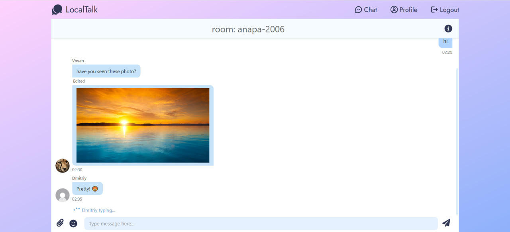

# LocalTalk


## Описание
LocalTalk — это веб-приложение для общения, работающее без сервера в рамках одного браузера. Каждая вкладка представляет собой отдельную сессию. Пользователи могут входить в чат, идентифицируя себя и выбирая комнату, в которой хотят общаться. Данные чатов сохраняются и восстанавливаются при повторном входе.

## Функциональность
- Чат работает без сервера, в пределах одного браузера.
- Каждая вкладка создает новую пользовательскую сессию.
- Пользователь выбирает имя и комнату чата при входе.
- Сообщения и данные чата сохраняются в локальном хранилище и не удаляются при закрытии браузера.
- Поддержка emoji в сообщениях.
- Поддержка изображений.

## Технологии

- **React** + TypeScript
- **Zustand** для управления состоянием
- **Tailwind CSS** для стилизации
- **chatscope/chat-ui-kit-react** для UI-компонентов чата


## Установка и запуск

1. Клонируйте репозиторий:
   ```sh
   git clone https://github.com/koborochka/localtalk.git
   ```
2. Установите зависимости:
   ```sh
   npm install
   ```
3. Запустите приложение:
   ```sh
   npm run dev
   ```
